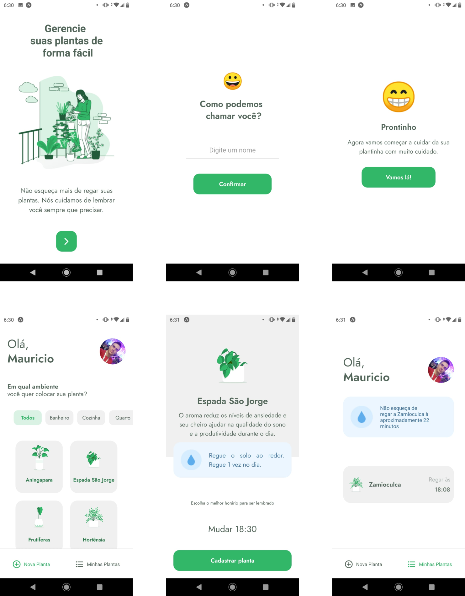

<h1 align="center">
    
</h1>

<h3 align="center">
  Nunca mais esqueça de regar suas plantinhas com o PlantManager
</h3>

---

## Sobre o projeto
Este projeto foi construído durante a quinta edição do evento nlw promovido pela Rocketseat, o mesmo é um projeto de aplicativo mobile construído com React Native.

O aplicativo desenvolvido permite cadastrar as plantinhas que você possui em sua casa, a partir de tipos de plantas já cadastradas no sistema, que trazem informações sobres os cuidados ideias para manter sua plantinha sempre saudável. Também é possível checar em quais ambients suas plantinhas preferem estar, como sala, cozinha, quarto e outros.

Esse aplicativo emitirá notificações sempre que estiver na hora de regar alguma plantiinha que você tenha cadastrado no app, você nunca mais esquecerá de regar suas plantinhas :D

  

O Aplicativo foi construido com React Native usando o Expo como base para acelerar sua criação, com isso este aplicativo é executado tanto em dispositivos Android como Ios. Os dados do aplicativo são fornecidos por um API false, na sessão seguinte há instruções de como executa-lá

## Get Started
Para executar este aplicativo em seu celular, você deve seguir os passos descrito abaixo

- Descubra o endereço IP do seu computado
- Acesse o arquivo [./server/package.json](./server/package.json) e altere o endereço ip existente na linha 7 do arquivo para o seu endereço
- Acesse o arquivo [./src/services/api.ts](./src/services/api.ts) e altere o endereço ip do parâmetro baseURL para o seu endereço
- Acesse a pasta server pelo terminal e execute o comando `yarn install`
- Na mesma pasta execute o comando `yarn start` e a API falsa será executada
- Acesse a raiz do projeto pelo terminal e execute o comando `yarn install`
- Na mesma pasta execute o comando `yarn expo start`
- Instale o aplicativo de celular Expo em seu smartphone
- Use o aplicativo Expo para ler o QRCode que foi gerado em seu terminal, com isso seu celular irá executar o aplicativo

PS: Caso prefira, você pode usar um emulador Ios ou Android instalado em seu computador para executar este projeto, mas é recomendado que você já tenha alguma experiência com essa emuladores para faze-lo

## Licença

Esse projeto está sob a licença MIT. Veja o arquivo [LICENSE](LICENSE) para mais detalhes.

---

by Mauricio Redmerski André
